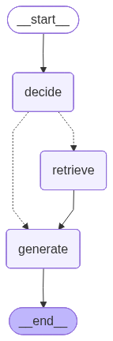

# Agentic RAG with LangGraph, Groq LLMs, and FAISS

This project implements a lightweight **Agentic Retrieval-Augmented Generation (RAG)** system using **LangGraph**, **Groq LLMs**, **FAISS**, and **PDF-based retrieval**. The system intelligently decides whether a question needs external context, retrieves only when necessary, and generates grounded answers.

## Pipeline Overview

The workflow consists of three nodes:

1. **decide** – Uses a Groq LLM to determine if retrieval is required.  
2. **retrieve** – Loads a PDF, chunks it, embeds it, and performs FAISS similarity search.  
3. **generate** – Produces the final answer using context (if retrieved).

### Graph flow:

## Key Features

- Agentic decision-making for selective retrieval  
- PDF ingestion, chunking, and embedding  
- FAISS vector store for fast similarity search  
- Custom Groq LLM wrapper  
- Fully orchestrated using LangGraph

## Tech Stack

- **LangGraph**  
- **LangChain Community**  
- **FAISS**  
- **Groq LLMs (Llama 3.3)**  
- **Python**

## How It Works

1. Load and chunk the PDF.  
2. Embed chunks using a small embedding model (e.g., GTE-small / MiniLM).  
3. Store embeddings in a FAISS vector store.  
4. During a query:
   - The **decide** node predicts whether retrieval is needed.
   - If required, **retrieve** returns the top relevant chunks.
   - **generate** produces a final answer grounded in the retrieved text.

